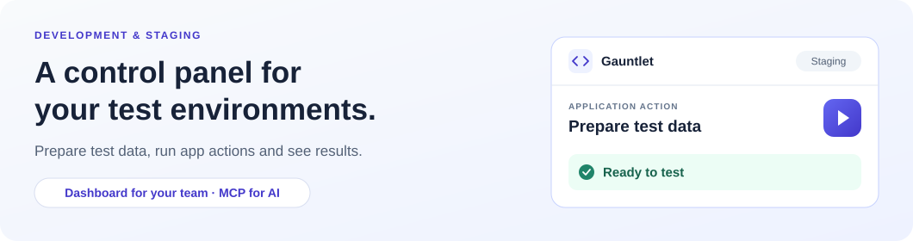

# Gauntlet



Gauntlet gives testers, developers and AI clients a shared interface for
working with development and staging applications. Change a test date, prepare
an application for review, replay a known event or open a test-user session —
without building a separate admin screen for each action.

Your application decides what is available. Register an operation once and
Gauntlet makes it accessible through a generated dashboard form and,
optionally, MCP.


Gauntlet coordinates the work and shows results. Actions run inside your
applications, using their own services and data.

## What you can do


- **Prepare test scenarios:** invoke application-owned helpers with validated
  inputs, presets and searchable field values.
- **See what happened:** follow execution progress and inspect results, logs
  and artifacts.
- **Control changes:** use the operation's confirmation, dry-run, retry and
  cancellation policies where supported.
- **Work across stacks:** connect Node.js, Next.js, Symfony and Spring
  applications to the same dashboard.
- **Let AI operate the same catalog:** connect an MCP client to discover and
  run the capabilities your applications expose.

Gauntlet is for non-production environments only. Authentication is not
included in v0.1: keep access private, or behind an authenticating reverse
proxy, and limited to trusted users. Application adapters must remain disabled
in production and must never be reachable from outside the private network.
Gauntlet is open source, but that does not make a public deployment safe.

## Get started

**Trying the project locally?** Follow the [local demo](docs/local-development.md#run-the-local-demo).
It starts the dashboard with a sample application and needs no Docker or
access to your application's data.

**Connecting your own applications on Docker?** Use the standalone Compose
installation. It pulls the public `ghcr.io/8lines/gauntlet` image, so no
registry login is needed; you need Docker and an application with a
[Gauntlet adapter](docs/integrations/index.md).

From this repository:

```sh
cd deploy/compose
./gauntlet init
```

Edit the generated `.env` and `config.yaml` to select your non-production
environment and applications, then start Gauntlet:

```sh
./gauntlet up -d --wait
./gauntlet ps
```

Startup creates the private `gauntlet` Docker network if needed.
[Attach your application adapter](deploy/compose/README.md#integrating-another-compose-application)
to that network without publishing its port.

Open **http://127.0.0.1:8080** on the Docker host, or use your approved private
tunnel. Select an application and operation, fill in the form, review its
impact and run it.

The [getting-started guide](docs/getting-started.md) walks through the required
configuration and first operation. For Kubernetes, use the
[Helm installation guide](deploy/helm/README.md).

## Connect an application

Install the matching SDK from npm, Packagist or GitHub Packages (see
[installing packages](docs/releases/installing-packages.md)), register the
actions your team needs, and add the application to Gauntlet's configuration. The dashboard and MCP use the same
catalog; there is no separate AI adapter to maintain.

| Your application | Integration guide |
| --- | --- |
| Node.js | [Node adapter](packages/typescript/node/README.md) |
| Next.js App Router | [Next.js bridge](packages/typescript/next/README.md) |
| Symfony | [Symfony bundle](packages/php/symfony-bundle/README.md) |
| Spring Boot | [Spring starter](packages/java/spring-boot-starter/README.md) |

Start with [application integration](docs/integrations/index.md), then follow
[authoring an operation](docs/extensions/authoring.md) to add your first action.

## Connect an AI client

Enable `GAUNTLET_MCP_ENABLED=true` on the server, then configure your MCP
client to use **Streamable HTTP** at `http://127.0.0.1:8080/mcp` (or your private
Gauntlet URL). In Compose, set the variable in `.env`; in Helm, set
`mcp.enabled: true`.

AI clients can discover operations, run them, check results, cancel supported
runs and work with data sources, uploads and session-launch artifacts.
See [MCP setup and tools](docs/mcp.md) for configuration and limits.

## Where to go next

| I want to… | Read |
| --- | --- |
| Install Gauntlet and run my first operation | [Get started](docs/getting-started.md) |
| Use the dashboard or troubleshoot an operation | [User guide](docs/user-guide.md) |
| Work on Gauntlet locally | [Local development](docs/local-development.md) |
| Understand the system and its boundaries | [Architecture](docs/architecture.md) |
| Find API, SDK, configuration or deployment details | [Documentation index](docs/README.md) |
| Contribute a change | [Contributing](CONTRIBUTING.md) |

## License

Gauntlet is open source under the [Apache License 2.0](LICENSE), maintained by
8lines. See [NOTICE](NOTICE), [release notes](CHANGELOG.md),
[contributing](CONTRIBUTING.md) and [security reporting](SECURITY.md).
