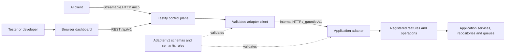

# Architecture

Gauntlet is one control plane for one configured non-production environment.
Applications own their operations and data. The control plane discovers the
capabilities they explicitly register and exposes them to a browser dashboard
and optional MCP clients.

For installation and everyday use, start with [getting started](getting-started.md)
and the [user guide](user-guide.md).

## System boundaries

There are three interfaces:

| Interface | Caller | Purpose |
| --- | --- | --- |
| `/api/v1` | Dashboard or REST client | Discover targets, read definitions, invoke and follow operations. |
| `/mcp` | AI client | Use the same capabilities through MCP tools; enabled explicitly. |
| `/_gauntlet/v1` | Control plane | Internal application adapter API, implemented by each supported stack. |

The dashboard and MCP clients do not choose adapter URLs. A target ID resolves
to an origin from deployment configuration. The control plane holds no Docker
socket, Kubernetes discovery token, database connection or application command
bus. Domain access stays in the application handler.

## Components and ownership

| Component | Owns |
| --- | --- |
| `apps/dashboard` | Target navigation, generated forms, confirmation, progress and result presentation. |
| `apps/server` | Configuration, target registry, discovery, REST and MCP transport, validation and in-memory projections. |
| `packages/dashboard-client` | Bounded server-to-adapter requests, schema/semantic validation, ETags and SSE parsing. It is not a browser package. |
| `packages/protocol` | Adapter v1 OpenAPI, closed JSON Schemas, wire types, semantic rules, revisions and cross-language fixtures. |
| Core SDKs | Catalog registries, input/output validation, run lifecycle, storage and coordination interfaces. |
| Framework integrations | The normalized HTTP mount and optional endpoint wiring. |
| Consuming applications | Operation handlers, domain authorization, services and independently controlled adapter enablement. |

The [repository guide](reference/repository.md) maps these responsibilities to
source directories and supporting tools.

## Discovery and execution

1. The operator supplies an instance identity and explicit adapter origins in
   a versioned configuration file selected by `GAUNTLET_CONFIG_FILE`.
2. The control plane fetches each adapter's health and manifest. It compares
   both the environment name and kind with that target's `expectedEnvironment`.
   A malformed, disabled or mismatched adapter is isolated from healthy targets.
3. The manifest supplies features, operation summaries, data-source declarations,
   profiles and optional capabilities. A last-known manifest may remain visible
   when a target is offline; it does not grant permission to invoke it.
4. The caller fetches one complete operation definition. It contains the input
   schema, UI schema, presets, bindings, execution policy and output contract.
5. The caller resolves dynamic input choices, obtains file references if needed,
   and submits typed input with the exact operation revision. Required
   confirmation binds to the operation ID, revision and impact.
6. The control plane checks compatibility and admission requirements. The adapter
   repeats validation, applies idempotency and concurrency policy, stores the
   run and invokes its registered application handler.
7. The handler reports progress and output through its run context. Synchronous
   calls may finish immediately; asynchronous calls return an accepted run.
8. The dashboard follows validated snapshots through polling or optional SSE.
   MCP polls the same projections and exposes explicit cancellation and
   session-launch tools.

The adapter remains the source of truth for execution. A run response must be
valid for its operation definition and may not regress an existing projection.
Protocol Problems are sanitized before crossing the control-plane boundary.

## Operation definitions and adapter packages

The [protocol model](reference/protocol-model.md) separates portable definition
data from executable application behavior. An operation can describe complex
forms and rich results without teaching Gauntlet about Symfony entities,
Java commands or Node services. Adding an operation registers a handler; it
does not create a new application-specific HTTP route.

| Stack | Core runtime | HTTP integration |
| --- | --- | --- |
| Node.js 24–26 | [TypeScript Core](../packages/typescript/core/README.md) | [Node adapter](../packages/typescript/node/README.md) |
| Next.js App Router | [TypeScript Core](../packages/typescript/core/README.md) | [Next.js bridge](../packages/typescript/next/README.md) behind trusted raw-target ingress |
| PHP 8.3+ / Symfony 7.4 or 8.x | [PHP Core](../packages/php/core/README.md) | [Symfony bundle](../packages/php/symfony-bundle/README.md) |
| Java 21 / Spring Boot 4.1.1 | [Java Core](../packages/java/core/README.md) | [Spring starter](../packages/java/spring-boot-starter/README.md) |

Across stacks, the SDKs provide registries, semantic validation, immutable run
snapshots, replaceable storage, HMAC idempotency fingerprints, execution
coordination, cooperative timeout/cancellation, secret-retention rules and
progress/results. A consuming application mounts exactly one transport.

Optional upload, events and session-launch routes require typed capability
implementations. Managed cancellation wiring differs: TypeScript exposes its
`RunManager` bridge; Spring installs a default bridge unless an application
`CancelRunEndpoint` replaces it; Symfony applications register
`ManagedCancelRunEndpoint` explicitly. Follow the integration guide for the
stack rather than assuming a manifest capability creates an endpoint.

## Embeddable widget

An application may embed a floating button and panel on its own pages. The
panel runs in an iframe served from the control plane and talks to the host
page over a versioned `postMessage` channel; it reuses the dashboard's form,
confirmation and run-progress views over `/api/v1` and adds no new adapter
surface. See the [embeddable widget guide](integrations/widget.md).

| Unit | Responsibility |
| --- | --- |
| `packages/widget-channel` (`@8lines/gauntlet-widget-channel`) | Versioned `postMessage` message types and validators shared by loader and panel. |
| `packages/widget-loader` | The injected loader: button, iframe, URL matcher, subject merging, command queue, handshake. Builds to one dependency-free file. |
| `packages/widget` (`@8lines/gauntlet-widget`) | Public npm package: typed command functions over `window.Gauntlet`, SSR-safe no-ops. |
| `apps/dashboard` widget entry | Panel UI in the iframe, built separately into `dist-widget`. Reuses the dashboard's existing form, run and API code. |
| `packages/protocol` | The `placements` schema, profile, semantic rules and fixtures operations use to declare where they appear. |
| `apps/server` | `/widget/*` routes, widget configuration, framing headers, `placements` pass-through, MCP `subjectType` filter. |

## State and scaling

The control plane keeps validated target snapshots and run projections in
memory. REST and MCP share that store. Supported deployments use **one replica**;
the Helm chart uses `Recreate`.

Restarting Gauntlet loses dashboard/MCP projection history. It does not
cancel application runs already accepted by an adapter and cannot undo domain
changes. Adapter persistence is separate from control-plane history.

Bundled SDK stores and coordinators are process-local defaults. A replicated
application must provide a shared durable `RunStore`, a stable idempotency
secret, distributed execution coordination and cancellation publication. SSE
also requires shared event history and a live backplane. A shared database
alone does not establish FIFO, cancellation or event guarantees.

See [run lifecycle](reference/run-lifecycle.md) for admission, replay, timeout,
cancellation and execution-lease semantics.

## Trust and deployment boundaries

Authentication is optional: with `auth.mode: password` one request guard
requires a session (cookie or bearer) or a static API token for `/api` and
`/mcp`, and records the principal as the run actor
([authentication](deployment/authentication.md)). The dashboard, REST API and
MCP endpoint must still remain behind a verified private boundary. MCP Origin
validation and operation confirmations do not authenticate a user. Authorization and
domain rules remain in the application.

Environment metadata rejects accidental misconfiguration; it cannot prove the
physical cluster, namespace, host or account. Deploy one instance per coherent
non-production environment, keep adapter origins private, and disable adapters
independently in production. There is no production override.

Operation input may select only explicitly registered domain choices. It must
not become arbitrary SQL, a shell command, a class name, a route, a queue topic
or a destination URL. See the [safety boundary](safety/non-production-boundary.md)
and [deployment guide](deployment/decision-guide.md).

## Terminology

| Term | Meaning |
| --- | --- |
| Target | One configured application adapter. |
| Feature | A grouping of operations, such as Applications or Payments. |
| Operation | One explicitly registered, typed application action. |
| Definition | The complete machine-readable input, execution and output contract. |
| Data source | A bounded query/resolve provider for field choices. |
| Preset | Initial or locked input values for a common scenario. |
| Run | The sequence-numbered snapshots of one operation invocation. |
| Profile | A supported document extension, such as rich forms or rich results. |
| Capability | An optional endpoint contract, such as uploads or cancellation. |
| Artifact | A typed result item, such as a table, download or browser-session reference. |

## Compatibility and further reading

Wire-contract changes start in `packages/protocol` and update schemas, fixtures,
semantic rules, affected SDKs and language-neutral conformance together.
Framework-neutral conformance tests talk over HTTP and never import an SDK.

- [Control-plane HTTP API](reference/control-plane-api.md)
- [MCP tools and client setup](mcp.md)
- [Protocol definitions](reference/protocol-model.md)
- [Run lifecycle and scaling](reference/run-lifecycle.md)
- [Repository guide](reference/repository.md)
- [Local development and verification](local-development.md)

This page describes the current implementation. Documents under
[`superpowers`](superpowers) record earlier design decisions and plans; they are
historical context, not current setup instructions.
