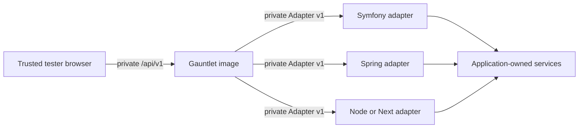

# Release Documentation Implementation Plan

> **For agentic workers:** REQUIRED SUB-SKILL: Use superpowers:subagent-driven-development (recommended) or superpowers:executing-plans to implement this plan task-by-task. Steps use checkbox (`- [ ]`) syntax for tracking.

**Goal:** Replace stale pre-release documentation with an accurate, navigable internal product manual covering architecture, every directory, private installation, standalone and Kubernetes deployment, safety boundaries, extension authoring, release, upgrade, and rollback.

**Architecture:** `README.md` becomes the concise product entry point and directory map, while focused documents under `docs/` own architecture, deployment choice, integration, safety, extension, and release procedures. Package READMEs remain the authoritative API/install guides for their artifact. A local documentation checker validates relative links, required safety statements, runnable command versions, and the absence of known stale claims.

**Tech Stack:** GitHub-flavored Markdown, Mermaid, Node.js 24 `node:test`, package-manager CLIs, Docker Compose, Helm, GitHub Packages, GHCR

## Spec

Implement the approved design in `docs/superpowers/specs/2026-09-02-release-standalone-safety-skills-design.md`. Documentation must follow shipped behavior produced by the implementation plans and must not turn a planned capability into a release claim.

## Global Constraints

- Document only behavior proven by the implementation and release checks; never describe planned behavior as shipped.
- The canonical product is private and proprietary under `8lines/gauntlet`.
- The dashboard and Fastify control plane ship in one image; the browser calls `/api/v1`, never an adapter directly.
- One Gauntlet instance controls one explicitly named non-production environment scope and may contain many targets.
- Supported environment kinds are exactly `development`, `test`, `qa`, `staging`, `uat`, `preview`, and `sandbox`; production has no supported value or bypass.
- Both dashboard and adapter routes stay behind loopback, VPN, Tailscale, private ingress, or another trusted network boundary because Gauntlet authentication is deferred in v0.1.
- Docker Compose and Helm are the supported deployment methods. There is no Docker/Kubernetes discovery and no Kubernetes RBAC.
- The v0.1 control plane is one replica with process-local history. Scaling and durable history are not documented as available.
- TypeScript packages support Node.js 24–26, PHP packages support PHP 8.3+, the Symfony bundle supports Symfony 7.2+, and Java packages use Java 21.
- All examples use exact version `0.1.0` or an immutable digest and never `latest`.
- `GAUNTLET_CONFIG_FILE=/etc/gauntlet/config.yaml` is primary. `GAUNTLET_TARGETS_JSON` is documented only as deprecated migration compatibility and still requires instance/target environment identity.
- Composer consumers declare both private VCS repositories because dependency `repositories` entries are root-only.
- Confirmation prevents accidental execution but is not authentication or domain authorization. Dry-run is claimed only when it reaches handler code and a mutation-sentinel test proves the non-mutating path.
- No documentation may recommend arbitrary SQL, shell, HTTP proxying, request-selected command classes, queue topics, routes, filesystem paths, or URLs.
- The release workflow remains tag-gated and artifacts are immutable; rollback selects an earlier version/digest rather than deleting or overwriting a release.
- Documentation must explicitly list deferred authentication, one-replica limits, and non-durable dashboard history.
- Cross-plan execution order is mandatory: complete private-release-engineering Tasks 1–9, complete AI-skills Tasks 1–6 (including creation of `docs/ai-skills.md`), complete this plan's Tasks 1–9, and only then run private-release-engineering Task 10 or create `v0.1.0`. This ordering ensures release scripts exist before skills integrate, and all documentation exists before its checks become a mandatory release phase.

---

### Task 1: Establish the documentation contract and local checker

**Files:**
- Create: `docs/documentation-manifest.json`
- Create: `scripts/docs/check-docs.mjs`
- Create: `scripts/docs/test/support.mjs`
- Create: `scripts/docs/test/check-docs.test.mjs`
- Modify: `package.json`
- Test: `scripts/docs/test/check-docs.test.mjs`

**Interfaces:**
- Consumes: a repository root and `docs/documentation-manifest.json` containing required files, headings, forbidden stale phrases, and exact versioned command fragments.
- Produces: `checkDocumentation({ root }) -> { errors: string[] }`, test helpers `fixture(files)` and `read(relativePath)`, and root command `pnpm docs:check`; exit 0 means all local links and documentation invariants pass.

- [ ] **Step 1: Write failing checker tests against a temporary documentation tree**

Create `scripts/docs/test/support.mjs` first so every documentation test uses the same explicit filesystem behavior:

```javascript
import { readFileSync } from "node:fs";
import { mkdtemp, mkdir, writeFile } from "node:fs/promises";
import { tmpdir } from "node:os";
import { dirname, join, resolve } from "node:path";

export async function fixture(files) {
  const root = await mkdtemp(join(tmpdir(), "gauntlet-docs-"));
  for (const [relativePath, contents] of Object.entries(files)) {
    const destination = resolve(root, relativePath);
    await mkdir(dirname(destination), { recursive: true });
    await writeFile(destination, contents, "utf8");
  }
  return root;
}

export function read(relativePath) {
  return readFileSync(resolve(process.cwd(), relativePath), "utf8");
}
```

Then create the failing checker test:

```javascript
import assert from "node:assert/strict";
import test from "node:test";
import { checkDocumentation } from "../check-docs.mjs";
import { fixture } from "./support.mjs";

test("reports missing files, broken local links, and stale release claims", async () => {
  const root = await fixture({
    "README.md": "# Gauntlet\n[missing](docs/missing.md)\nFuture dashboard\nimage: latest\n",
    "docs/documentation-manifest.json": JSON.stringify({
      requiredFiles: ["README.md", "SECURITY.md"],
      forbiddenPhrases: ["Future dashboard", "image: latest"],
      requiredPhrases: ["authentication is deferred"],
    }),
  });
  const { errors } = await checkDocumentation({ root });
  assert.deepEqual(errors, [
    "README.md links to missing docs/missing.md",
    "missing required file SECURITY.md",
    "README.md contains forbidden phrase: Future dashboard",
    "README.md contains forbidden phrase: image: latest",
    "required phrase is absent: authentication is deferred",
  ]);
});
```

- [ ] **Step 2: Run the test and observe the checker is absent**

Run: `node --test scripts/docs/test/check-docs.test.mjs`

Expected: FAIL with `ERR_MODULE_NOT_FOUND` for `scripts/docs/check-docs.mjs`.

- [ ] **Step 3: Implement the closed documentation manifest**

Use this top-level shape:

```json
{
  "schemaVersion": 1,
  "requiredFiles": [
    "README.md",
    "LICENSE",
    "CHANGELOG.md",
    "SECURITY.md",
    "CONTRIBUTING.md",
    "docs/README.md",
    "docs/architecture.md",
    "docs/deployment/decision-guide.md",
    "docs/safety/non-production-boundary.md",
    "docs/integrations/index.md",
    "docs/extensions/authoring.md",
    "docs/releases/private-registry-access.md",
    "docs/releases/releasing.md",
    "docs/releases/upgrading.md",
    "docs/releases/rollback.md",
    "docs/ai-skills.md"
  ],
  "forbiddenPhrases": [
    "Future dashboard",
    "registry publication is not part of this milestone",
    "image: latest",
    "ghcr.io/8lines/gauntlet:latest"
  ],
  "requiredPhrases": [
    "authentication is deferred",
    "one replica",
    "GAUNTLET_CONFIG_FILE",
    "PHP 8.3",
    "Symfony 7.2",
    "Node.js 24–26",
    "Java 21"
  ]
}
```

Required phrases may occur across the required documentation corpus rather than every file.

- [ ] **Step 4: Implement local-link and content validation**

`checkDocumentation` must:

1. sort files and errors for deterministic output;
2. resolve Markdown links relative to their source document;
3. ignore `https:`, `http:`, `mailto:`, and in-page-only anchors;
4. percent-decode local paths and reject links escaping the repository;
5. verify linked files exist;
6. verify required files, phrases, and forbidden phrases;
7. reject unversioned `@8lines/gauntlet-*` install examples and `latest` container/chart examples.

Export the function for unit tests and run it as a CLI only when `import.meta.url` is the entry module.

- [ ] **Step 5: Add the root documentation command**

```json
{
  "scripts": {
    "docs:check": "node scripts/docs/check-docs.mjs && node --test scripts/docs/test/*.test.mjs"
  }
}
```

- [ ] **Step 6: Verify unit behavior while the real documentation still fails**

Run: `node --test scripts/docs/test/check-docs.test.mjs`

Expected: fixture tests PASS. Running `node scripts/docs/check-docs.mjs` is expected to fail until Tasks 2–7 create the required documents.

- [ ] **Step 7: Commit the documentation contract**

```bash
git add package.json docs/documentation-manifest.json scripts/docs
git commit -m "test(docs): define release documentation contract"
```

### Task 2: Add repository policy and release-history documents

**Files:**
- Create: `CHANGELOG.md`
- Create: `SECURITY.md`
- Create: `CONTRIBUTING.md`
- Modify: `docs/documentation-manifest.json`
- Create: `scripts/docs/test/policy-docs.test.mjs`
- Test: `scripts/docs/test/policy-docs.test.mjs`

**Interfaces:**
- Consumes: the proprietary license and `0.1.0` release model from the private-release-engineering plan.
- Produces: explicit legal boundary, private vulnerability reporting path, contribution/test rules, and changelog entry for the first internal release.

- [ ] **Step 1: Write failing policy-document tests**

```javascript
test("security policy uses private reporting and states the non-production boundary", () => {
  const security = read("SECURITY.md");
  assert.match(security, /security\/advisories\/new/);
  assert.match(security, /Do not open a public issue/i);
  assert.match(security, /non-production/i);
  assert.match(security, /authentication is deferred/i);
});

test("changelog contains the exact first release", () => {
  const changelog = read("CHANGELOG.md");
  assert.match(changelog, /^## \[0\.1\.0\] - 2026-09-/m);
  assert.match(changelog, /dashboard and Fastify control plane/i);
  assert.match(changelog, /Docker Compose and Helm/i);
});
```

- [ ] **Step 2: Run the policy tests and observe missing files**

Run: `node --test scripts/docs/test/policy-docs.test.mjs`

Expected: FAIL because `CHANGELOG.md` and `SECURITY.md` do not exist.

- [ ] **Step 3: Write the initial changelog**

Use Keep a Changelog-style headings with one `0.1.0` entry dated `2026-09-03`. Its `Added`, `Security`, and `Known limitations` sections enumerate the shipped dashboard/control plane, Adapter v1, language SDKs, Compose/Helm, non-production denial, private boundary, deferred auth, one replica, and process-local history.

- [ ] **Step 4: Write the private security policy**

`SECURITY.md` must direct reporters to:

```text
https://github.com/8lines/gauntlet/security/advisories/new
```

It must state that a public issue is not an acceptable vulnerability channel, name `0.1.x` as the supported line, classify accidental production exposure/public adapter exposure/secret leakage as security issues, and explain that network isolation remains mandatory because authentication is deferred.

- [ ] **Step 5: Write contribution requirements**

`CONTRIBUTING.md` documents:

- proprietary contribution scope;
- protocol-first changes through OpenAPI, schemas, fixtures, SDKs, and conformance together;
- test-first RED–GREEN–REFACTOR;
- PHP 8.3/Symfony 7.2 minimum compatibility;
- Node 24 and 26 boundary verification;
- Java 21 verification;
- `pnpm release:verify` before review;
- prohibition on secrets, production enablement, public adapter examples, and arbitrary dispatchers;
- required changelog and migration notes for public contracts.

- [ ] **Step 6: Verify policy documents**

Run: `node --test scripts/docs/test/policy-docs.test.mjs`

Expected: PASS.

- [ ] **Step 7: Commit repository policy**

```bash
git add CHANGELOG.md SECURITY.md CONTRIBUTING.md docs/documentation-manifest.json scripts/docs/test/policy-docs.test.mjs
git commit -m "docs: define release and security policy"
```

### Task 3: Rewrite the root README and architecture index around the shipped product

**Files:**
- Create: `docs/README.md`
- Create: `docs/architecture.md`
- Create: `apps/server/README.md`
- Modify: `README.md`
- Modify: `apps/dashboard/README.md`
- Modify: `docs/documentation-manifest.json`
- Create: `scripts/docs/test/root-readme.test.mjs`
- Test: `scripts/docs/test/root-readme.test.mjs`

**Interfaces:**
- Consumes: the shipped dashboard routes, Fastify API, Adapter v1 topology, release artifact names, and real repository directories.
- Produces: a concise product entry point, complete top-level directory map, documentation navigation index, and component ownership boundaries.

- [ ] **Step 1: Write failing root-document tests**

```javascript
const readme = read("README.md");
for (const path of [
  "apps/dashboard",
  "apps/server",
  "packages/protocol",
  "packages/dashboard-client",
  "packages/typescript",
  "packages/php",
  "packages/java",
  "conformance",
  "examples",
  "deploy/compose",
  "deploy/helm",
  "skills",
  "skill-evals",
  ".github",
  "scripts/release",
]) assert.match(readme, new RegExp(path.replace(/[/.]/g, "\\$&")));

assert.doesNotMatch(readme, /Future dashboard/);
assert.match(readme, /browser.*\/api\/v1/is);
assert.match(readme, /never.*adapter directly/is);
```

- [ ] **Step 2: Run the test and observe the stale README**

Run: `node --test scripts/docs/test/root-readme.test.mjs`

Expected: FAIL on missing `apps/dashboard` and the stale `Future dashboard` claim.

- [ ] **Step 3: Rewrite the README entry flow**

Use this section order:

```text
Gauntlet
What it is
Safety boundary
Five-minute standalone start
How applications connect
Architecture
Repository map
Supported stacks and artifacts
Verification
Documentation
Current limitations
```

The five-minute start uses `deploy/compose`, an exact `0.1.0` image, `GAUNTLET_CONFIG_FILE`, two sample targets, and loopback/private binding. It must not imply the sample adapters are generic production services.

- [ ] **Step 4: Replace the repository map with every owned directory**

For each listed path document both what belongs there and what must stay outside it. State explicitly:

- application-owned operations remain in consuming applications;
- deployment-specific target URLs remain outside package source;
- `skill-evals` contains synthetic pressure-test fixtures, not runtime code;
- `.github` owns verification/publication only;
- `docs/superpowers` stores design and execution records, not end-user setup.

- [ ] **Step 5: Write the architecture and docs indexes**

`docs/README.md` links to every focused document by user intent. `docs/architecture.md` contains the actual topology:



Describe explicit target configuration, manifest discovery, definition-driven UI, create-run flow, environment comparison, adapter-owned run state, and sanitized Problems.

- [ ] **Step 6: Document server and dashboard component ownership**

`apps/server/README.md` lists `/health`, `/ready`, and `/api/v1`, file configuration, headless test construction, and release-image dashboard requirement. `apps/dashboard/README.md` documents generated forms, confirmations, progress/results, responsive viewports, and same-origin API use; it does not contain deployment credentials.

- [ ] **Step 7: Verify root and architecture documentation**

Run: `node --test scripts/docs/test/root-readme.test.mjs && node scripts/docs/check-docs.mjs`

Expected: root-specific tests PASS; the corpus checker may still report focused documents created in later tasks, but no stale README errors remain.

- [ ] **Step 8: Commit product and architecture documentation**

```bash
git add README.md docs/README.md docs/architecture.md apps/server/README.md apps/dashboard/README.md docs/documentation-manifest.json scripts/docs/test/root-readme.test.mjs
git commit -m "docs: describe the shipped Gauntlet product"
```

### Task 4: Document standalone and Kubernetes deployment choices

**Files:**
- Create: `docs/deployment/decision-guide.md`
- Modify: `deploy/compose/README.md`
- Modify: `deploy/compose/.env.example`
- Modify: `deploy/compose/config.example.yaml`
- Modify: `deploy/helm/gauntlet/README.md`
- Modify: `docs/documentation-manifest.json`
- Create: `scripts/docs/test/deployment-docs.test.mjs`
- Test: `scripts/docs/test/deployment-docs.test.mjs`

**Interfaces:**
- Consumes: operational Compose distribution, Helm chart values/schema, environment descriptor, private networking model, exact image/chart coordinates, and one-replica limitation.
- Produces: decision tree plus copyable setup, upgrade, rollback, logs, target-change, shared-network, private-ingress, and image-pull instructions.

- [ ] **Step 1: Write failing deployment-document tests**

```javascript
const guide = read("docs/deployment/decision-guide.md");
assert.match(guide, /many small Docker Compose applications/i);
assert.match(guide, /shared external network.*gauntlet/is);
assert.match(guide, /Kubernetes.*one namespace/is);
assert.match(guide, /ingress.*disabled/is);
assert.match(guide, /one replica/i);
assert.doesNotMatch(guide, /latest/);

const compose = read("deploy/compose/README.md");
assert.match(compose, /docker compose up -d/);
assert.match(compose, /127\.0\.0\.1/);
assert.match(compose, /docker network create gauntlet/);
```

- [ ] **Step 2: Run the tests and observe the focused guide is absent**

Run: `node --test scripts/docs/test/deployment-docs.test.mjs`

Expected: FAIL because `docs/deployment/decision-guide.md` does not exist.

- [ ] **Step 3: Write the deployment decision guide**

Use this exact decision:

```text
One VPS or several small Compose projects -> deploy/compose and external network gauntlet.
One Kubernetes namespace/environment -> OCI Helm chart with ClusterIP and ingress disabled.
Production, ambiguous environment, or required public adapter -> do not deploy Gauntlet.
Multiple independent environments -> one isolated Gauntlet instance per enabled non-production environment.
```

Document per-environment clusters, per-namespace scoping, and a development Compose deployment as examples without hard-coded customer credentials or hostnames.

- [ ] **Step 4: Complete the standalone runbook**

Document these exact commands:

```bash
docker login ghcr.io
docker network inspect gauntlet >/dev/null 2>&1 || docker network create gauntlet
cp deploy/compose/.env.example deploy/compose/.env
cp deploy/compose/config.example.yaml deploy/compose/config.yaml
docker compose --project-directory deploy/compose up -d
docker compose --project-directory deploy/compose ps
curl --fail http://127.0.0.1:8080/ready
```

Explain how separate Compose projects join `external: true` network `gauntlet`, why adapter ports remain unpublished, how to bind the dashboard to a Tailscale/VPN IP, and how target edits require a restart.

- [ ] **Step 5: Complete the Helm runbook**

Document exact private chart installation:

```bash
helm registry login ghcr.io
helm pull oci://ghcr.io/8lines/charts/gauntlet --version 0.1.0
helm upgrade --install gauntlet oci://ghcr.io/8lines/charts/gauntlet \
  --version 0.1.0 \
  --namespace acme-staging \
  --values gauntlet.values.yaml
```

Explain `ClusterIP`, ingress disabled, no service-account token, no RBAC, checksum rollout, private ALB/Tailscale examples, cross-namespace NetworkPolicy values, imagePullSecret, and single-replica behavior.

- [ ] **Step 6: Verify deployment documentation**

Run: `node --test scripts/docs/test/deployment-docs.test.mjs`

Expected: PASS; all referenced Compose and chart files exist.

- [ ] **Step 7: Commit deployment documentation**

```bash
git add docs/deployment deploy/compose deploy/helm/gauntlet docs/documentation-manifest.json scripts/docs/test/deployment-docs.test.mjs
git commit -m "docs: add standalone and Kubernetes runbooks"
```

### Task 5: Document private registry access and every supported integration

**Files:**
- Create: `docs/integrations/index.md`
- Create: `docs/releases/private-registry-access.md`
- Modify: `packages/protocol/README.md`
- Modify: `packages/dashboard-client/README.md`
- Modify: `packages/typescript/core/README.md`
- Modify: `packages/typescript/node/README.md`
- Modify: `packages/typescript/next/README.md`
- Modify: `packages/php/core/README.md`
- Modify: `packages/php/symfony-bundle/README.md`
- Modify: `packages/java/README.md`
- Modify: `packages/java/core/README.md`
- Modify: `packages/java/spring-boot-starter/README.md`
- Modify: `conformance/runner/README.md`
- Modify: `docs/documentation-manifest.json`
- Create: `scripts/docs/test/integration-docs.test.mjs`
- Test: `scripts/docs/test/integration-docs.test.mjs`

**Interfaces:**
- Consumes: the published package coordinates, supported versions, framework mounting APIs, environment gates, private package permissions, and conformance CLI.
- Produces: one stack selector, package-specific setup instructions, secret-safe authentication examples, and framework verification commands.

- [ ] **Step 1: Write failing private-install examples tests**

```javascript
const access = read("docs/releases/private-registry-access.md");
assert.match(access, /@8lines:registry=https:\/\/npm\.pkg\.github\.com/);
assert.match(access, /https:\/\/maven\.pkg\.github\.com\/8lines\/gauntlet/);
assert.match(access, /8lines\/gauntlet-php-core/);
assert.match(access, /8lines\/gauntlet-symfony-bundle/);
assert.match(access, /oci:\/\/ghcr\.io\/8lines\/charts\/gauntlet/);
assert.doesNotMatch(access, /ghp_[A-Za-z0-9]+/);
assert.doesNotMatch(access, /_authToken=[^$]/);
```

- [ ] **Step 2: Run the tests and observe the registry guide is absent**

Run: `node --test scripts/docs/test/integration-docs.test.mjs`

Expected: FAIL because `docs/releases/private-registry-access.md` does not exist.

- [ ] **Step 3: Document npm consumer authentication and install**

Use a committed `.npmrc` containing only:

```ini
@8lines:registry=https://npm.pkg.github.com
//npm.pkg.github.com/:_authToken=${NODE_AUTH_TOKEN}
```

Explain that humans need a classic PAT with `read:packages`; GitHub Actions may use its repository `GITHUB_TOKEN` only after that repository is granted package Actions access. Install examples pin `0.1.0`.

- [ ] **Step 4: Document Composer private VCS installation**

The root application declares both repositories:

```json
{
  "repositories": [
    { "type": "vcs", "url": "https://github.com/8lines/gauntlet-php-core.git" },
    { "type": "vcs", "url": "https://github.com/8lines/gauntlet-symfony-bundle.git" }
  ],
  "require": {
    "8lines/gauntlet-php-core": "0.1.0",
    "8lines/gauntlet-symfony-bundle": "0.1.0"
  }
}
```

Recommend a short-lived fine-grained token with Contents read only for those repositories, injected through CI `COMPOSER_AUTH`, or an SSH deploy key. Warn against committing `auth.json` or placing tokens in shell history.

- [ ] **Step 5: Document Maven and GHCR access**

Maven consumers use `https://maven.pkg.github.com/8lines/gauntlet` and exact coordinate `dev.eightlines.gauntlet:spring-boot-starter:0.1.0`. Explain `GITHUB_ACTOR` and read token sourcing without embedding either in `build.gradle.kts`.

For Compose, `docker login ghcr.io` precedes pull. Kubernetes uses a namespace-scoped docker registry Secret referenced through `imagePullSecrets`; no credential appears in chart values committed to Git.

- [ ] **Step 6: Update every package README from monorepo consumption to released consumption**

Each package README includes:

- exact package coordinate/version;
- runtime/framework minimum;
- install/auth link;
- structured environment configuration;
- stable idempotency secret requirement where applicable;
- one transport mount;
- disabled, mismatch, conformance, and public-denial verification;
- distributed runtime limitation where applicable.

Next.js additionally documents trusted raw-target ingress and adversarial encoded-path tests. Symfony examples use PHP 8.3/Symfony 7.2 compatible syntax and configuration.

- [ ] **Step 7: Verify integration documentation**

Run: `node --test scripts/docs/test/integration-docs.test.mjs && node scripts/docs/check-docs.mjs`

Expected: integration-specific checks PASS; only documents from later tasks may remain missing.

- [ ] **Step 8: Commit registry and integration documentation**

```bash
git add docs/integrations docs/releases/private-registry-access.md packages conformance/runner/README.md docs/documentation-manifest.json scripts/docs/test/integration-docs.test.mjs
git commit -m "docs: document private SDK installation"
```

### Task 6: Document the non-production boundary and safe extension authoring

**Files:**
- Create: `docs/safety/non-production-boundary.md`
- Create: `docs/extensions/authoring.md`
- Modify: `docs/documentation-manifest.json`
- Create: `scripts/docs/test/safety-docs.test.mjs`
- Test: `scripts/docs/test/safety-docs.test.mjs`

**Interfaces:**
- Consumes: structured environment schema, adapter/control-plane startup gates, exact target comparison, confirmation acknowledgement, dry-run propagation, existing runtime controls, and extension-authoring contracts.
- Produces: operator threat boundary and an implementation checklist for narrow application-owned operations/data sources without broadening transport or network exposure.

- [ ] **Step 1: Write failing safety-document tests**

```javascript
const safety = read("docs/safety/non-production-boundary.md");
for (const kind of ["development", "test", "qa", "staging", "uat", "preview", "sandbox"])
  assert.match(safety, new RegExp(`\\b${kind}\\b`));
for (const alias of ["prod", "production", "live"])
  assert.match(safety, new RegExp(`\\b${alias}\\b`));
assert.match(safety, /cannot prove physical infrastructure identity/i);
assert.match(safety, /authentication is deferred/i);

const authoring = read("docs/extensions/authoring.md");
assert.match(authoring, /arbitrary SQL/i);
assert.match(authoring, /mutation-sentinel/i);
assert.match(authoring, /confirmation.*not.*authorization/is);
```

- [ ] **Step 2: Run the tests and observe missing safety documents**

Run: `node --test scripts/docs/test/safety-docs.test.mjs`

Expected: FAIL because both focused documents are absent.

- [ ] **Step 3: Write the non-production boundary document**

Describe all defense layers in execution order:

```text
deployment omission from production
private network boundary
adapter disabled by default
adapter structured-environment startup denial
control-plane structured-environment startup denial
exact target expected-environment comparison
fixed normalized routes and allow-listed handlers
schema/revision/confirmation/idempotency/runtime validation
application-domain validation and authorization
```

State explicitly that environment metadata prevents accidental configuration but cannot prove physical infrastructure identity when an operator lies. There is no `ALLOW_PRODUCTION`, break-glass, public ingress, or production kind.

- [ ] **Step 4: Write the extension authoring guide**

Use one complete narrow example per supported runtime family and this decision contract:

```text
One tester-visible outcome -> one registered operation.
Payload selects typed business inputs -> never implementation class, route, SQL, command/topic/path/URL.
Mutation -> truthful write/destructive impact.
Destructive -> confirmationRequired=true and idempotency=required.
Dry-run -> handler receives mode and mutation-sentinel proves no write.
Secret/file -> explicit inputHandling and leak tests.
Long execution -> bounded timeout, cancellation checks, and truthful coordinator/store deployment.
```

Data-source guidance requires bounded page size, opaque cursor, stable resolve ordering, tenant filtering, and no arbitrary query language.

- [ ] **Step 5: Document the verification evidence for an extension**

Require negative schema/domain tests, confirmation tests, idempotency replay, dry-run mutation sentinel, output validation, secret leak checks, cancellation/timeout where declared, and live conformance/framework integration. Confirmation is described only as accidental-click protection.

- [ ] **Step 6: Verify safety and authoring documents**

Run: `node --test scripts/docs/test/safety-docs.test.mjs`

Expected: PASS.

- [ ] **Step 7: Commit safety and extension documentation**

```bash
git add docs/safety docs/extensions docs/documentation-manifest.json scripts/docs/test/safety-docs.test.mjs
git commit -m "docs: define non-production extension safety"
```

### Task 7: Add release, upgrade, rollback, and AI-skill runbooks

**Files:**
- Create: `docs/releases/releasing.md`
- Create: `docs/releases/upgrading.md`
- Create: `docs/releases/rollback.md`
- Modify: `docs/ai-skills.md`
- Modify: `docs/README.md`
- Modify: `docs/documentation-manifest.json`
- Create: `scripts/docs/test/release-runbooks.test.mjs`
- Test: `scripts/docs/test/release-runbooks.test.mjs`

**Interfaces:**
- Consumes: `pnpm release:verify`, `pnpm release:dry-run`, tag workflow, package registries, immutable digests, Compose/Helm commands, the two verified AI skills, and the initial `docs/ai-skills.md` created by AI-skills Task 6.
- Produces: maintainer release checklist, consumer upgrade/rollback procedures, and safe skill installation/invocation instructions.

- [ ] **Step 1: Write failing runbook tests**

```javascript
const releasing = read("docs/releases/releasing.md");
assert.match(releasing, /pnpm release:dry-run/);
assert.match(releasing, /git tag -s v0\.1\.0/);
assert.match(releasing, /COMPOSER_SPLIT_APP_ID/);
assert.match(releasing, /COMPOSER_SPLIT_APP_PRIVATE_KEY/);
assert.match(releasing, /partial release/i);

const rollback = read("docs/releases/rollback.md");
assert.match(rollback, /previous.*digest/is);
assert.match(rollback, /helm rollback/);
assert.match(rollback, /never delete.*package version/is);
```

- [ ] **Step 2: Run the tests and observe missing runbooks**

Run: `node --test scripts/docs/test/release-runbooks.test.mjs`

Expected: FAIL because the release runbooks do not exist.

- [ ] **Step 3: Write the maintainer release runbook**

Document:

1. clean `main` and successful `pnpm release:dry-run`;
2. `node scripts/release/version.mjs --check --tag v0.1.0`;
3. repository/registry collision preflight;
4. signed tag `git tag -s v0.1.0` and `git push origin v0.1.0`;
5. watching `release.yml`;
6. verifying npm/Maven/Composer/image/chart external consumers;
7. checking image SLSA/SPDX attestations and release checksums;
8. handling a partial release only by an equality-checked workflow rerun;
9. never overwriting, deleting, or reusing `0.1.0`.

Explain the GitHub Free/private attestation limitation and why BuildKit attestations are used.

- [ ] **Step 4: Write upgrade and rollback procedures**

Upgrade order:

```text
read changelog and protocol migration
upgrade application SDK packages
run adapter conformance and negative safety tests
upgrade Gauntlet chart/image
verify exact target environments
retain previous versions/digests until acceptance
```

Rollback uses the previous image/chart digest or package version, `docker compose pull && up -d`, or `helm rollback`. SDK rollback is a dependency change and application redeployment. No registry version is deleted or republished.

- [ ] **Step 5: Augment the existing AI-skill installation and boundary guide**

Use the checked-in installer:

```bash
node scripts/skills/install.mjs gauntlet-app-integration
node scripts/skills/install.mjs gauntlet-extension-authoring
pnpm skills:validate
```

Preserve the content-bound evaluation and installation guidance written by AI-skills Task 6. Add links from the documentation index and release/upgrade context; document invocation as `$gauntlet-app-integration` and `$gauntlet-extension-authoring`, explain when to use each, and state that the integration skill stops on production ambiguity while the extension skill never mounts transports or changes network exposure. Do not recreate or overwrite the file.

- [ ] **Step 6: Verify runbooks and the full documentation corpus**

Run:

```bash
node --test scripts/docs/test/release-runbooks.test.mjs
pnpm docs:check
```

Expected: PASS with no missing file, stale phrase, broken local link, unversioned install, or `latest` deployment error.

- [ ] **Step 7: Commit release and skill runbooks**

```bash
git add docs/releases docs/ai-skills.md docs/README.md docs/documentation-manifest.json scripts/docs/test/release-runbooks.test.mjs
git commit -m "docs: add release upgrade rollback and skill runbooks"
```

### Task 8: Verify all documented commands against clean artifacts

**Files:**
- Create: `scripts/docs/verify-documented-commands.mjs`
- Create: `scripts/docs/test/documented-commands.test.mjs`
- Modify: `docs/documentation-manifest.json`
- Modify: `package.json`
- Modify: only documentation files whose commands fail local verification or remote-coordinate static validation
- Test: every command block marked as runnable in `README.md`, package READMEs, deployment guides, and release runbooks
- Test: `scripts/docs/test/documented-commands.test.mjs`

**Interfaces:**
- Consumes: clean staged `0.1.0` artifacts at an explicit `--release-root`, the finished documentation corpus, `image/gauntlet-0.1.0.docker.tar`, and `helm/gauntlet-0.1.0.tgz`.
- Produces: `planDocumentedCommandChecks({ root, releaseRoot, temporaryRoot })`, `runDocumentedCommandChecks({ root, releaseRoot, runner })`, root command `pnpm docs:verify-commands`, and evidence that local installation/deployment commands match real paths, ports, routes, and supported runtime versions. Remote registry coordinates are syntax-checked but never fetched or published by this verifier.

- [ ] **Step 1: Write a failing local-only command-plan test**

Create `scripts/docs/test/documented-commands.test.mjs` with an injected runner and exact artifact expectations:

```javascript
import assert from "node:assert/strict";
import test from "node:test";
import { planDocumentedCommandChecks } from "../verify-documented-commands.mjs";

test("uses staged 0.1.0 deployment artifacts and contains no remote mutation or pull", async () => {
  const plan = await planDocumentedCommandChecks({
    root: "/workspace/gauntlet",
    releaseRoot: "/workspace/gauntlet/.artifacts/release/0.1.0",
    temporaryRoot: "/tmp/gauntlet-documented-commands",
  });
  assert.equal(plan.imageArchive, "/workspace/gauntlet/.artifacts/release/0.1.0/image/gauntlet-0.1.0.docker.tar");
  assert.equal(plan.localImage, "gauntlet.local/gauntlet:0.1.0");
  assert.equal(plan.chartArchive, "/workspace/gauntlet/.artifacts/release/0.1.0/helm/gauntlet-0.1.0.tgz");
  assert.deepEqual(plan.composeFiles, [
    "/workspace/gauntlet/deploy/compose/compose.yaml",
    "/tmp/gauntlet-documented-commands/compose.local-image.yaml",
  ]);
  const executable = plan.commands.map(({ command, args }) => [command, ...args].join(" ")).join("\n");
  assert.doesNotMatch(executable, /docker (login|pull|push)|helm (pull|push)|npm publish|git push|gh api/);
  assert.match(executable, /docker load --input .*gauntlet-0\.1\.0\.docker\.tar/);
  assert.match(executable, /helm template gauntlet-docs .*gauntlet-0\.1\.0\.tgz/);
  assert.match(executable, /image\.repository=gauntlet\.local\/gauntlet/);
  assert.match(executable, /image\.tag=0\.1\.0/);
});
```

- [ ] **Step 2: Run the test and observe the command verifier is absent**

Run: `node --test scripts/docs/test/documented-commands.test.mjs`

Expected: FAIL with `ERR_MODULE_NOT_FOUND` for `scripts/docs/verify-documented-commands.mjs`.

- [ ] **Step 3: Extract and classify documented commands**

Run the docs checker in extraction mode:

```bash
documented_commands_root="$(mktemp -d)"
node scripts/docs/check-docs.mjs --extract-runnable "$documented_commands_root"
```

Expected: a manifest mapping every extracted block to source file and line.

Extend `docs/documentation-manifest.json` so every shell block is classified as `local-runnable`, `remote-coordinate`, or `release-mutation`. The verifier executes only `local-runnable` blocks. It statically validates that remote examples use exactly `0.1.0`, `ghcr.io/8lines/gauntlet`, `oci://ghcr.io/8lines/charts`, `https://npm.pkg.github.com`, `https://maven.pkg.github.com/8lines/gauntlet`, and the two named Composer repositories. It refuses to execute `remote-coordinate` and `release-mutation` blocks.

- [ ] **Step 4: Implement and execute local package consumers**

Run npm, local Composer VCS, and local Maven consumer commands produced by `pnpm release:stage`. Confirm each loads the documented public entry point using Node 24, PHP 8.3/Symfony 7.2, and Java 21 respectively.

- [ ] **Step 5: Implement the exact local image substitution and Compose smoke**

Require these staged files and reject a release-root basename other than `0.1.0`:

```text
.artifacts/release/0.1.0/image/gauntlet-0.1.0.docker.tar
.artifacts/release/0.1.0/helm/gauntlet-0.1.0.tgz
```

Fail before loading if `gauntlet.local/gauntlet:0.1.0` already exists. Load only the staged archive:

```bash
docker load --input .artifacts/release/0.1.0/image/gauntlet-0.1.0.docker.tar
docker image inspect gauntlet.local/gauntlet:0.1.0 --format '{{ index .Config.Labels "org.opencontainers.image.version" }}'
```

Expected label: `0.1.0`. In the unique temporary root write this exact override:

```yaml
services:
  gauntlet:
    image: gauntlet.local/gauntlet:0.1.0
    pull_policy: never
```

Copy `deploy/compose/config.example.yaml` to the temporary root, write an env file with `GAUNTLET_IMAGE=gauntlet.local/gauntlet:0.1.0`, `GAUNTLET_BIND=127.0.0.1`, an OS-reserved loopback port, and the absolute temporary config path, then run:

```bash
docker compose --env-file "$documented_commands_root/local.env" \
  -f deploy/compose/compose.yaml \
  -f "$documented_commands_root/compose.local-image.yaml" \
  up -d --wait --pull never
```

Verify `/health`, `/ready`, `/api/v1/targets`, and `/` through that loopback port. In `finally`, run Compose `down`, then remove only `gauntlet.local/gauntlet:0.1.0` after confirming its image ID is the one loaded by this run. Create the external `gauntlet` network only when absent, record ownership, and remove it only when this run created it. No command may contact GHCR.

- [ ] **Step 6: Render the staged chart archive without a registry or cluster**

Use the local chart archive directly:

```bash
helm show chart .artifacts/release/0.1.0/helm/gauntlet-0.1.0.tgz
helm template gauntlet-docs .artifacts/release/0.1.0/helm/gauntlet-0.1.0.tgz \
  --set-string image.repository=gauntlet.local/gauntlet \
  --set-string image.tag=0.1.0 \
  --set-string image.digest= \
  > "$documented_commands_root/helm-rendered.yaml"
kubeconform -strict -summary "$documented_commands_root/helm-rendered.yaml"
```

Parse `helm show chart` and require `version: 0.1.0` and `appVersion: 0.1.0`. Assert rendered workload image `gauntlet.local/gauntlet:0.1.0`, one replica, ClusterIP, and no public Ingress/RBAC. Do not run `helm pull`, `helm push`, `helm install`, or `kubectl apply`.

- [ ] **Step 7: Add the root command and verify the local-only flow**

Add:

```json
{
  "scripts": {
    "docs:verify-commands": "node scripts/docs/verify-documented-commands.mjs"
  }
}
```

Run:

```bash
pnpm release:stage
node --test scripts/docs/test/documented-commands.test.mjs
pnpm docs:check
pnpm docs:verify-commands -- --release-root .artifacts/release/0.1.0
```

Expected: PASS with no registry login, remote pull, remote publish, GitHub API call, Git mutation, or Kubernetes apply. An actual smoke of remote documented coordinates is optional only after publication and belongs at the release boundary; it is not part of `docs:verify-commands` or pull-request CI.

- [ ] **Step 8: Commit the local documentation verifier and evidence-driven corrections**

```bash
git add README.md CHANGELOG.md SECURITY.md CONTRIBUTING.md docs apps/*/README.md packages/*/README.md packages/typescript/*/README.md packages/php/*/README.md packages/java/*/README.md conformance/runner/README.md deploy/*/README.md scripts/docs package.json
git commit -m "docs: verify release instructions locally"
```

### Task 9: Make documentation verification a mandatory final release phase

**Files:**
- Modify: `scripts/release/test/dry-run.test.mjs`
- Modify: `scripts/release/verify.mjs`
- Modify: `package.json`
- Test: `scripts/release/test/dry-run.test.mjs`
- Test: `scripts/docs/test/documented-commands.test.mjs`

**Interfaces:**
- Consumes: the complete documentation corpus, passing `pnpm docs:check`, passing local-only `pnpm docs:verify-commands`, and staged inventory at `.artifacts/release/0.1.0`.
- Produces: final `plannedReleasePhases()` order with `documentation` after `inventory`; both `pnpm release:verify` and `pnpm release:dry-run` fail closed on stale documentation or a broken documented local command.

- [ ] **Step 1: Add the failing final phase/order test only now that documentation exists**

Extend `scripts/release/test/dry-run.test.mjs`:

```javascript
assert.deepEqual(await plannedReleasePhases(), [
  "source",
  "node",
  "php",
  "java",
  "conformance",
  "skills",
  "dashboard",
  "image",
  "compose",
  "helm",
  "security",
  "packages",
  "inventory",
  "documentation",
]);

const documentation = commandsForPhase("documentation");
assert.deepEqual(documentation, [
  ["pnpm", ["docs:check"]],
  ["pnpm", ["docs:verify-commands", "--", "--release-root", ".artifacts/release/0.1.0"]],
]);
```

- [ ] **Step 2: Run the final order test and observe RED**

Run: `node --test scripts/release/test/dry-run.test.mjs`

Expected: FAIL because the `documentation` phase and its two fixed commands are absent.

- [ ] **Step 3: Append the documentation phase after inventory**

Modify `scripts/release/verify.mjs` so `documentation` is the final phase and invokes exactly the two argument-array commands asserted above. It may run only after `packages` and `inventory` have created and checksummed `.artifacts/release/0.1.0`; no earlier phase may call the documented-command verifier.

Keep `release:verify` usable on a dirty development tree. Keep `release:dry-run` responsible for the clean-tree gate and local OCI-registry rehearsal; because it calls `release:verify`, it inherits both documentation checks before performing its separate local-registry push/pull verification.

- [ ] **Step 4: Run focused GREEN verification**

Run:

```bash
node --test scripts/release/test/dry-run.test.mjs
node --test scripts/docs/test/documented-commands.test.mjs
pnpm docs:check
pnpm docs:verify-commands -- --release-root .artifacts/release/0.1.0
```

Expected: PASS, with `documentation` last and no remote access from the documented-command verifier.

- [ ] **Step 5: Commit the final release/documentation integration**

```bash
git add package.json scripts/release/verify.mjs scripts/release/test/dry-run.test.mjs scripts/docs
git commit -m "build: gate releases on verified documentation"
```

- [ ] **Step 6: Run the complete release checks from the now-clean checkout**

Run:

```bash
pnpm release:verify
pnpm release:dry-run
```

Expected: PASS; both paths include static documentation checks and local documented-command execution. Only the dry-run additionally exercises the ephemeral loopback OCI registry. Neither path accesses GitHub registries or publishes anything.
